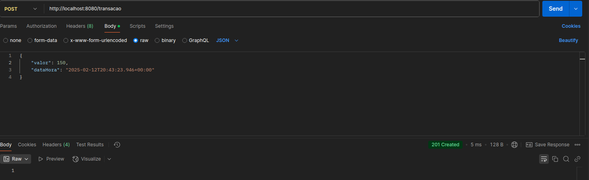
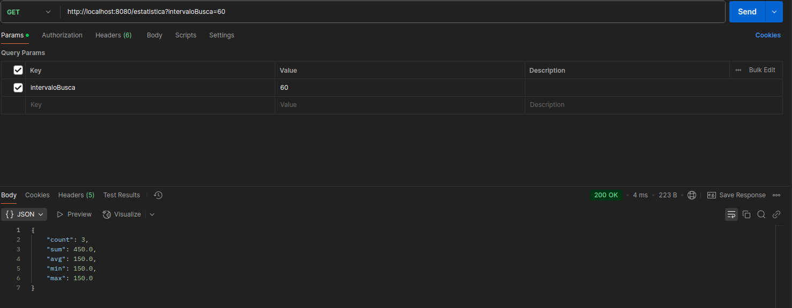

# API Transação

## Visão Geral
Este repositório contém a implementação de uma API REST para processar transações e calcular estatísticas em tempo real.

---

## Tecnologias Utilizadas
- **Java 21**
- **Spring Boot**
- **Sl4j**
- **Swagger**

---

## Funcionalidades
- **Receber Transações:** Endpoint para registrar transações enviadas pelo cliente.
- **Limpar Transações:** Endpoint para remover todas as transações armazenadas em memória.
- **Calcular Estatísticas:** Endpoint que retorna estatísticas das transações ocorridas nos últimos 60 segundos.

---

## Endpoints
1. **Realizar Transação**

2. **Deletar Transações**
3. **Gerar estatísticas das Transações nos últimos 60 segundos**

---

Desenvolvido por [Victor Ribeiro](https://github.com/victorribeirog).
